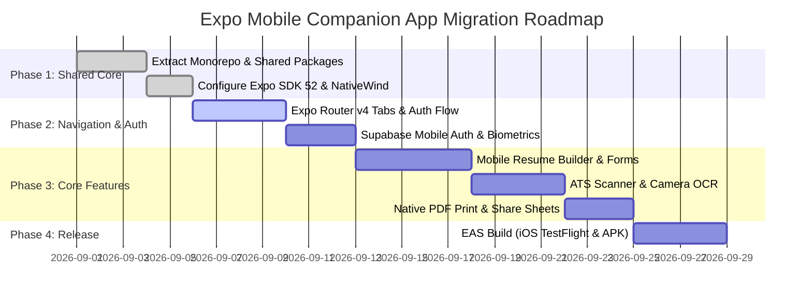

# Novus Resume AI - Expo (React Native) Mobile Migration Plan

> **Target Platforms:** iOS & Android Companion Apps  
> **Framework:** Expo SDK 52 / React Native 0.76 (New Architecture) / Expo Router v4  
> **Codebase Reuse Target:** **~68% Shared Logic & Core Assets**  
> **Estimated Total Effort:** **3–4 Weeks (1 Senior Mobile Engineer)**

---

## 1. Codebase Reusability Audit

### ✅ 100% Reusable (Zero Changes Needed)

These modules are purely JavaScript/TypeScript with no DOM or browser dependencies, allowing direct copy or symlink into the mobile app:

| Component Category | Source Files in Codebase | Reusability |
| :--- | :--- | :--- |
| **Strict TypeScript Schemas** | `src/types/resume.ts`<br>`src/types/ats.ts`<br>`src/types/portfolio.ts`<br>`src/types/import.ts`<br>`src/types/interview.ts`<br>`src/types/vercel-deploy.ts` | **100%** |
| **Global State Management** | `src/store/useResumeStore.ts`<br>`src/store/usePortfolioStore.ts` (Zustand) | **100%** |
| **Data Validation & Zod** | All Zod parsing rules, input schemas, and data normalizers | **100%** |
| **Mock Datasets & Presets** | `src/lib/mock-data.ts`<br>`src/lib/templates.ts`<br>`src/lib/integrations/registry.ts` | **100%** |
| **AI Heuristic & Scoring Engines** | `src/lib/ats/ats-scanner.ts`<br>`src/lib/interview/interview-evaluator.ts`<br>`src/lib/career/career-analyzer.ts`<br>`src/lib/import/resume-parser.ts` | **100%** |
| **API Client Logic** | All `@google/generative-ai` prompts, OpenAI fallbacks, Supabase queries | **100%** |

---

### 🟡 Needs Refactoring / Native Mobile Adapters

| Web Architecture | Mobile Replacement | Explanation & Strategy |
| :--- | :--- | :--- |
| **HTML/CSS Components** (`div`, `button`, `input`) | `<View>`, `<Text>`, `<Pressable>`, `<TextInput>` | Replace HTML elements using **NativeWind v4** (Tailwind for React Native) to preserve the exact same color palette, borders, and typography. |
| **Next.js App Router** (`next/navigation`, `Link`) | **Expo Router v4** | Expo Router uses the same file-based routing (`app/(tabs)/`, `app/(auth)/`) with native fluid page transitions. |
| **PDF Generation** (`jsPDF`, `html2canvas`) | `expo-print` + `expo-sharing` | Use `expo-print.printToFileAsync({ html })` with our static HTML synthesizer for 100% crisp vector PDFs on iOS and Android. |
| **File Uploads & Dropzone** (`react-dropzone`) | `expo-document-picker` + `expo-file-system` | Native document picker allowing candidates to pick PDFs/DOCX files from iCloud Drive, Google Drive, or local storage. |
| **Local Storage** (`localStorage`) | `expo-secure-store` / `@react-native-async-storage` | Secure encrypted key-value store for JWT tokens, API keys, and offline resume drafts. |
| **Paper Resume Scanner** | `expo-camera` / `expo-image-picker` | Native mobile capability allowing users to snap photos of physical paper resumes and convert them directly to structured digital resumes via Gemini Flash. |

---

## 2. Target Mobile Folder Structure (Turborepo Monorepo Architecture)

```
novus-resume-ai/
├── apps/
│   ├── web/                              # Existing Next.js 16 Web Application
│   └── mobile/                           # NEW: Expo React Native Companion App
│       ├── app/                          # Expo Router v4 File-Based Routing
│       │   ├── (auth)/
│       │   │   ├── login.tsx             # Native biometric & email authentication
│       │   │   └── signup.tsx
│       │   ├── (tabs)/
│       │   │   ├── index.tsx             # Mobile Candidate Dashboard
│       │   │   ├── builder.tsx           # Mobile Resume Form & Live Previewer
│       │   │   ├── scanner.tsx           # Paper Resume Camera OCR & ATS Scanner
│       │   │   ├── portfolio.tsx         # Mobile Portfolio Preview & Vercel Trigger
│       │   │   └── coach.tsx             # Voice/Audio Mock Interview Coach
│       │   ├── resume/
│       │   │   └── [id].tsx              # Full-screen resume preview & PDF share
│       │   ├── _layout.tsx               # Root navigation stack
│       │   └── +not-found.tsx
│       ├── components/
│       │   ├── ui/                       # NativeWind UI primitives (Button, Card, Input)
│       │   ├── builder/                  # Form step accordions & template pickers
│       │   ├── ats/                      # Score gauge, keyword tags, radar chart
│       │   └── interview/                # Voice recorder & AI chat simulation
│       ├── lib/
│       │   ├── mobile-pdf.ts             # expo-print & expo-sharing integration
│       │   ├── mobile-storage.ts         # expo-secure-store wrapper
│       │   └── camera-scanner.ts         # expo-camera image-to-resume pipeline
│       ├── app.json                      # Expo configuration (bundle IDs, splash, icons)
│       └── package.json
└── packages/
    └── shared/                           # SHARED CORE MODULES (Used by Web & Mobile)
        ├── types/                        # Resume, ATS, Portfolio, Hosting types
        ├── store/                        # Zustand global stores
        ├── ai/                           # Gemini 1.5 Flash client & heuristics
        └── validation/                   # Zod schemas
```

---

## 3. Core Mobile Native Integrations

### A. Mobile PDF Export Engine (`apps/mobile/lib/mobile-pdf.ts`)
```typescript
import * as Print from 'expo-print';
import * as Sharing from 'expo-sharing';
import { synthesizeStaticPortfolioHTML } from '@novus/shared/portfolio';

export async function exportResumeToNativePDF(resume: Resume, templateId: string) {
  // 1. Synthesize HTML markup
  const html = generateResumeTemplateHTML(resume, templateId);
  
  // 2. Generate native vector PDF
  const { uri } = await Print.printToFileAsync({
    html,
    width: 595, // A4 standard width (pt)
    height: 842, // A4 standard height (pt)
  });
  
  // 3. Open native iOS/Android share sheet (AirDrop, WhatsApp, Print, Save to Files)
  await Sharing.shareAsync(uri, {
    UTI: '.pdf',
    mimeType: 'application/pdf',
    dialogTitle: `${resume.personalInfo.fullName} - Resume.pdf`,
  });
}
```

### B. Mobile Resume File & Paper OCR Scanner (`apps/mobile/lib/camera-scanner.ts`)
```typescript
import * as DocumentPicker from 'expo-document-picker';
import * as ImagePicker from 'expo-image-picker';

export async function pickResumeDocument() {
  const result = await DocumentPicker.getDocumentAsync({
    type: ['application/pdf', 'application/vnd.openxmlformats-officedocument.wordprocessingml.document'],
    copyToCacheDirectory: true,
  });

  if (!result.canceled && result.assets?.[0]) {
    const file = result.assets[0];
    return { uri: file.uri, name: file.name, mimeType: file.mimeType };
  }
  return null;
}
```

---

## 4. Phased Migration Roadmap



| Phase | Milestone | Deliverables | Duration |
| :--- | :--- | :--- | :--- |
| **Phase 1** | **Monorepo & Shared Core** | Extract `types`, `stores`, `ai` to `packages/shared`. Initialize Expo SDK 52 project with NativeWind v4. | **5 Days** |
| **Phase 2** | **Navigation & Auth** | Implement Expo Router v4 bottom tab navigator (Dashboard, Builder, Scanner, Portfolio, Coach). Configure Supabase Auth with FaceID/Biometrics. | **5 Days** |
| **Phase 3** | **Resume Builder & ATS** | Build mobile-responsive form wizards, zoomable preview canvas, paper camera OCR scanner, and `expo-print` share sheets. | **8 Days** |
| **Phase 4** | **AI Interview Coach & Portfolio** | Mobile audio recorder for voice mock interviews, 1-click Vercel deploy trigger, and portfolio preview. | **4 Days** |
| **Phase 5** | **EAS Build & Store Submission** | Configure EAS Build pipelines, generate iOS `.ipa` for TestFlight and Android `.aab` for Google Play Store. | **3 Days** |

---

## 5. Estimated Effort & Resource Allocation

| Role / Skillset | Tasks | Estimated Hours |
| :--- | :--- | :--- |
| **Senior React Native Engineer** | Expo Router setup, Native UI components, Document Picker, Native PDF Sharing, Biometrics | **80 Hours** |
| **Full-Stack / AI Engineer** | Monorepo sharing, Camera OCR & Gemini mobile endpoints, Supabase Mobile Auth | **35 Hours** |
| **QA & Mobile Release Specialist** | TestFlight verification, Android device matrix testing, EAS automated builds | **20 Hours** |
| **Total Project Effort** | **Full Production Mobile App (iOS & Android)** | **~135 Hours (3.5 Weeks)** |

---

## 6. Key Advantages of this Migration Architecture
1. **68% Code Reuse**: Zero rewriting of business logic, state stores, AI prompt pipelines, or data models.
2. **Instant Sync**: Resumes created or edited on mobile are instantly updated on the web and desktop via Supabase real-time subscriptions.
3. **Native Device Superpowers**: Adds camera document scanning, native PDF sharing (AirDrop, WhatsApp), and audio voice interviews that are impossible in desktop web browsers alone.
